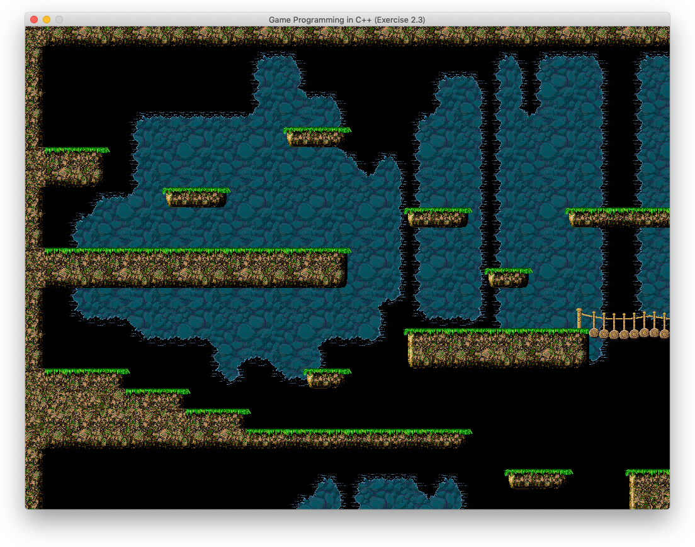

# Macでmakeを使って開発

## 第2章のコンパイルで以下のようなエラーが大量発生

```bash
In file included from BGSpriteComponent.cpp:9:
In file included from ./BGSpriteComponent.h:12:
In file included from ./math.h:11:
/Applications/Xcode.app/Contents/Developer/Toolchains/XcodeDefault.xctoolchain/usr/include/c++/v1/cmath:318:9: error:
      no member named 'signbit' in the global namespace
using ::signbit;
      ~~^
/Applications/Xcode.app/Contents/Developer/Toolchains/XcodeDefault.xctoolchain/usr/include/c++/v1/cmath:319:9: error:
      no member named 'fpclassify' in the global namespace
using ::fpclassify;
...
```

現象は[Stack Overflowのこの問題](https://stackoverflow.com/questions/58628377/catalina-c-using-cmath-headers-yield-error-no-member-named-signbit-in-th)
と同じであり、紹介されている方法のうち`Gralex`氏の方法で解決した。

## 課題2.2

次のように解釈して実装。

1. 複数のアニメーションの画像を`GetAnimTextures()`で取り込み、使用するアニメーションを`SetAnimation()`で取り出す。
2. ループしないアニメーションは最期のフレームを継続表示とする。

## 課題2.3

`Tiles.png`の画像は`256x768`ピクセルで、1つのタイルが`32x32`ピクセル、一行8タイル、24行であった。
また、レイアウトは一行32タイル、24行であるので、画面サイズは`1024x768`ピクセル。

### 完成した画面


