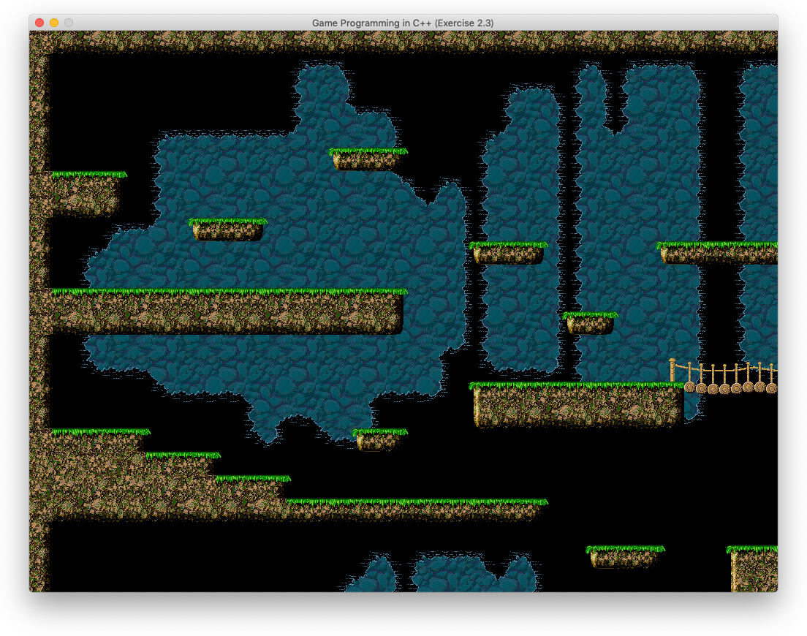
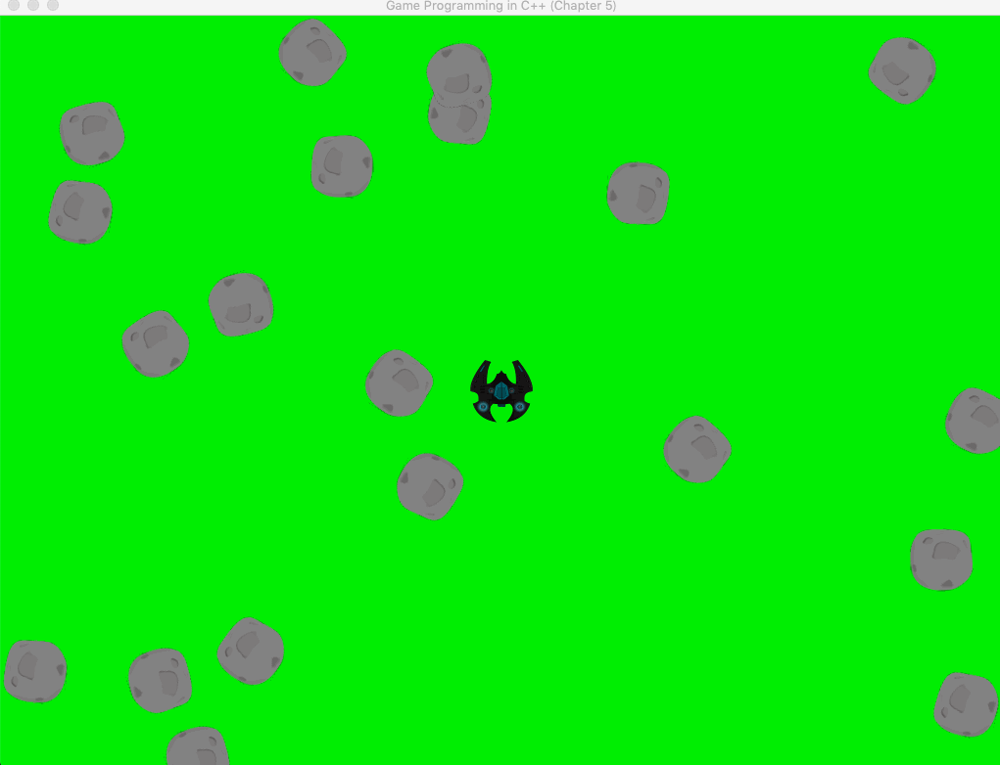
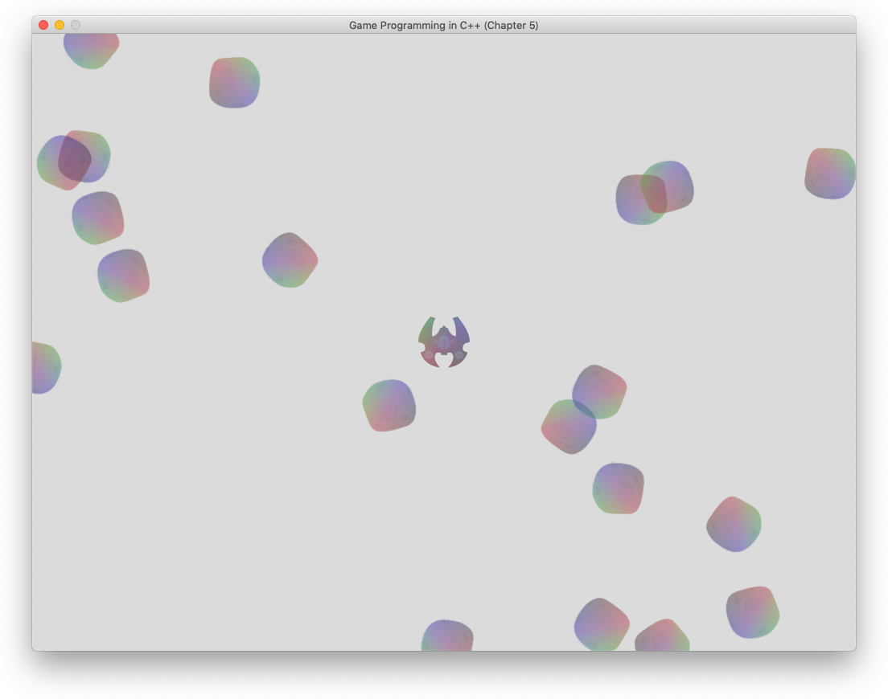
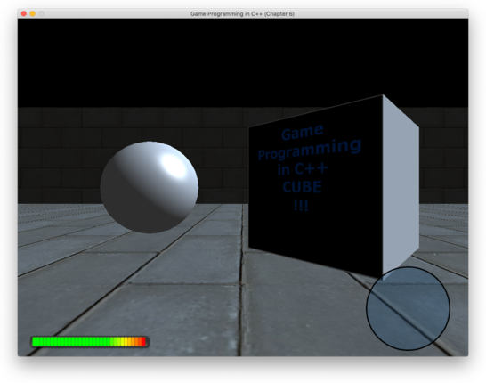
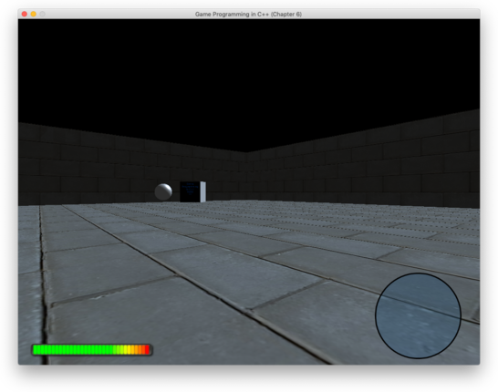
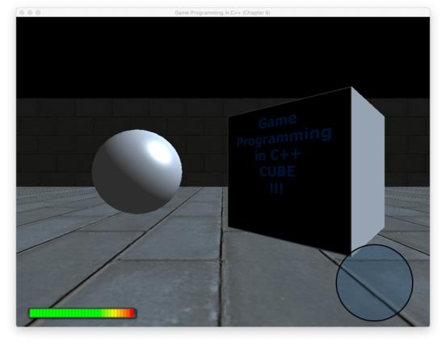
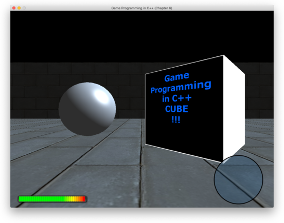
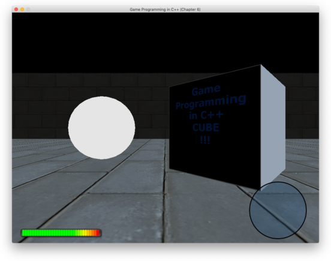
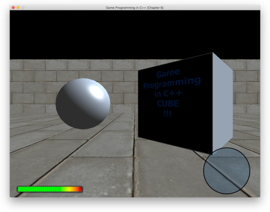
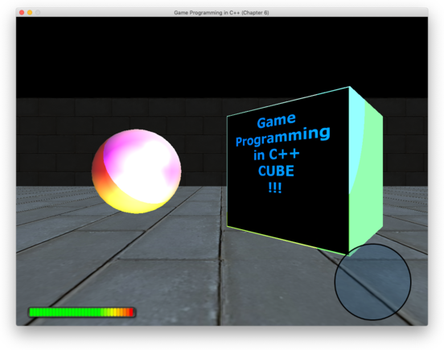

# Macでmakeを使って開発

## 第2章のコンパイルで以下のようなエラーが大量発生

```bash
In file included from BGSpriteComponent.cpp:9:
In file included from ./BGSpriteComponent.h:12:
In file included from ./math.h:11:
/Applications/Xcode.app/Contents/Developer/Toolchains/XcodeDefault.xctoolchain/usr/include/c++/v1/cmath:318:9: error:
      no member named 'signbit' in the global namespace
using ::signbit;
      ~~^
/Applications/Xcode.app/Contents/Developer/Toolchains/XcodeDefault.xctoolchain/usr/include/c++/v1/cmath:319:9: error:
      no member named 'fpclassify' in the global namespace
using ::fpclassify;
...
```

現象は[Stack Overflowのこの問題](https://stackoverflow.com/questions/58628377/catalina-c-using-cmath-headers-yield-error-no-member-named-signbit-in-th)
と同じであり、紹介されている方法のうち`Gralex`氏の方法で解決した。

## 課題2.2

次のように解釈して実装。

1. 複数のアニメーションの画像を`GetAnimTextures()`で取り込み、使用するアニメーションを`SetAnimation()`で取り出す。
2. ループしないアニメーションは最期のフレームを継続表示とする。

## 課題2.3

`Tiles.png`の画像は`256x768`ピクセルで、1つのタイルが`32x32`ピクセル、一行8タイル、24行であった。
また、レイアウトは一行32タイル、24行であるので、画面サイズは`1024x768`ピクセル。

### 完成した画面



## 課題3.2

消去の実装は、衝突時に宇宙船の状態を`EPaused`とし、位置をスクリーン外とした。オリジナルの`MovementComponent`は
ラッピング処理をしてスクリーン外の位置もスクリーン内に変換されて表示されてしまうので、ラッピング処理の有無をフラグとして
持つことにし、宇宙船はラッピング処理をしないようにした。

1. 宇宙船と小惑星の衝突判定を追加し、衝突したら、宇宙船を位置は画面中心、回転角ゼロでリセット
2. 衝突時、宇宙船を1秒消去し、その後、上記の条件で現れる

### `libpng warinig: iCCP: known incorrect sRGB profile`対策

表題でgoogleしてヒットした[ここ](https://www.henjins-toolbox.tech/entry/opencv_error1)の記載通り
以下のコマンドでpngファイルを処理したところ警告がなくなった。

```
convert Ship.png -strip Ship.png
```

## 課題3.3

課題が曖昧で、何が正解なのかわからなかった。調べたところ一人だけ解答を
[公開されていた方](https://github.com/TimFenwick15/game-programming)がいたので参考にさせてもらった。

- 力と初速度、質量をうまく設定しないとそれらしく動かない。
- レーザーを発射元の宇宙船の位置と回転角に合わせるには、作成時にこれらの値を設定するひつようがあった。そのため、`Actor`の定義を変更した。
- レーザーの一撃力はよほど大きな値を設定しないとすぐに減衰していまう。結局、初速の方が重要である。

## 第4章のゲーム

- スタートからゴールへの最適ルートを作成し、敵はそれに沿って進む
- 最適ルートはA*探索で見つける
- タワーは最適ルートがなくならない位置に作成できる。タワー位置に敵は進めない。
- タワー作成操作をした場合（建てられても、建てられなくても）常に最適ルートが再作成される。
- タワーはタイムスパン内に攻撃対象範囲に敵が入ると自動的に攻撃する。

## 課題4.1

### Towerクラスのステートを次のようにした

ただし、最適パスを外れたタワーを廃棄したら最適パスが直線的なものしか作成できなくなり、ゲームとしてはまったくつまらないものになった。
そのため、上下2マスまでは最適パスに隣接とし、攻撃範囲を2マス分以上とした。

1. Wait
      - 次に攻撃できる時間が来たら2へ
      - 構築済みのタワーが最適パスからそれたら4へ
      - それ以外はそのまま
2. Alert
      - 指定の範囲内に敵がいれば3へ
      - いなければ確率80%で待機時間を更新して1へ
      - それ以外はそのまま
3. Attack
      - 敵を攻撃し、待機時間を更新して1へ
4. Destroy
      - 自身を破棄する

## 課題4.2

現在はヒューリスティックが0固定で、スコアが1, 0, -1の3種類しかなく、コンピュータの手は最適解となっていない。
ヒューリスティックの実装が必要だが、それは今後の課題として、とりあえず後回しとする。

Chapter 4のSearch.cppからアルファ・ベータ法のコードをコピペしたら、深さ制限のコードが入ってなく、
実行したら全く結果が帰ってこず焦った。

## 第5章のソース

### コンパイルにMacのCoreFoundation, OpenGLの2つのフレームワークの指定が必要だった。

CoreFoundationの指定がない場合のエラー例

```
Undefined symbols for architecture x86_64:
"_CFBundleCreate", referenced from:
_query_DXT_capability in libSOIL.a(SOIL.o)
...
```

OpenGLの指定指定がない場合のエラー例

```
Undefined symbols for architecture x86_64:
"_glBindTexture", referenced from:
      Texture::Load(std::__1::basic_string<char, std::__1::char_traits<char>, std::__1::allocator<char> > const&) in Texture.cpp.o
      Texture::SetActive() in Texture.cpp.o
      _SOIL_internal_create_OGL_texture in libSOIL.a(SOIL.o)
      _SOIL_direct_load_DDS_from_memory in libSOIL.a(SOIL.o)
...
```

次のようにリンク時に両フレームワークを指定した。

```
FRAMEWORKS := -framework CoreFoundation -framework OpenGL
LDFLAGS := $(LIBDIRS) $(LIBS) $(FRAMEWORKS)
```

### libGLEWは実行時に`@executable_path/libGLEW.2.1.0.dylib`を読み込むので、その対応が必要だった。

いつものように`./build/a.out`と実行したら、次のようなエラーになった。

```
$ ./build/a.out
dyld: Library not loaded: @executable_path/libGLEW.2.1.0.dylib
      Referenced from: /Users/dspace/develop/game/game_cpp/Chapter05/./build/a.out
      Reason: image not found
Abort trap: 6
```

実行時のライブラリパスは次のコマンドで見ることができる。ちなみに`SDL`は`@rpath/libSDL2-2.0.0.dylib`、
`SDL_image`は`/usr/local/lib/libSDL2_image-2.0.0.dylib`（homewbrewで入れたもの）になっていた。
今は深追いしないが、いずれ`External`ディレクトリにあるものとバージョンがずれると問題になるだろう。

```
otool -l ./build/a.out
...
Load command 14
          cmd LC_LOAD_DYLIB
      cmdsize 64
         name @executable_path/libGLEW.2.1.0.dylib (offset 24)
   time stamp 2 Thu Jan  1 09:00:02 1970
      current version 2.1.0
compatibility version 2.1.0
```

次のように、make後にlibGLEWのシンボリックリンクを`./build/`にはるようにした。

```
# Target
default:
      make all
      ln -s $(abspath $(GLEWDIR)/lib/mac/libGLEW.2.1.0.dylib) build/.
```

以上、[macOSのコマンドラインアプリでdylibをよろしく扱う方法](https://qiita.com/omochimetaru/items/21d662b8df8bce1bc5ca)が参考になった。

## OpenGL使用によるゲーム初期化と出力コードの変更箇所

```diff
$ diff -uw Chapter04/Game.cpp Chapter05/Game.cpp
@@ -34,27 +35,54 @@
        return false;
    }

-   mWindow = SDL_CreateWindow("Game Programming in C++ (Chapter 4)", 100, 100, 1024, 768, 0);
+   // OpenGL属性の設定
+   // OpenGLコアプロファイルの使用
+   SDL_GL_SetAttribute(SDL_GL_CONTEXT_PROFILE_MASK, SDL_GL_CONTEXT_PROFILE_CORE);
+   // バージョン(3.3)の指定
+   SDL_GL_SetAttribute(SDL_GL_CONTEXT_MAJOR_VERSION, 3);
+   SDL_GL_SetAttribute(SDL_GL_CONTEXT_MINOR_VERSION, 3);
+   // RGBA各チャネル8ビットのカラーバッファを使用
+   SDL_GL_SetAttribute(SDL_GL_RED_SIZE, 8);
+   SDL_GL_SetAttribute(SDL_GL_GREEN_SIZE, 8);
+   SDL_GL_SetAttribute(SDL_GL_BLUE_SIZE, 8);
+   SDL_GL_SetAttribute(SDL_GL_ALPHA_SIZE, 8);
+   // ダブルバッファを有効にする
+   SDL_GL_SetAttribute(SDL_GL_DOUBLEBUFFER, 1);
+   // アードウェアアクセレーションを使用
+   SDL_GL_SetAttribute(SDL_GL_ACCELERATED_VISUAL, 1);
+
+   mWindow = SDL_CreateWindow("Game Programming in C++ (Chapter 5)", 100, 100,
+                              1024, 768, SDL_WINDOW_OPENGL);
    if (!mWindow)
    {
        SDL_Log("Failed to create window: %s", SDL_GetError());
        return false;
    }

-   mRenderer = SDL_CreateRenderer(mWindow, -1, SDL_RENDERER_ACCELERATED | SDL_RENDERER_PRESENTVSYNC);
-   if (!mRenderer)
+   // OpenGLコンテキストの作成
+   mContext = SDL_GL_CreateContext(mWindow);
+
+   // GLEWの初期化
+   glewExperimental = GL_TRUE;
+   if (glewInit() != GLEW_OK)
    {
-       SDL_Log("Failed to create renderer: %s", SDL_GetError());
+       SDL_Log("Failed to initialize GLEW.");
        return false;
    }

-   if (IMG_Init(IMG_INIT_PNG) == 0)
+   // GLEWが無害なエラーコードを発生させるプラットフォームがあるので
+   // それをクリア
+   glGetError();
+
+   // シェーダーの作成とコンパイル
+   if (!LoadShaders())
    {
-       SDL_Log("Unable to initialize SDL_image: %s", SDL_GetError());
+       SDL_Log("Failed to load shaders.");
        return false;
    }

-   Random::Init();
+   // スプライト描画用のクアッドを作成
+   CreateSpriteVerts();

    LoadData();
.........
@@ -162,31 +177,72 @@

 void Game::GenerateOutput()
 {
-   SDL_SetRenderDrawColor(mRenderer, 34, 139, 34, 255);
-   SDL_RenderClear(mRenderer);
-
-   // Draw all sprite components
+   // クリアカラーを灰色に設定
+   glClearColor(0.86f, 0.86f, 0.86f, 1.0f);
+   // カラーバッファをクリア
+   glClear(GL_COLOR_BUFFER_BIT);
+
+   // カラーバッファでのアルファブレンディングを有効化
+   glEnable(GL_BLEND);
+   glBlendFunc(GL_SRC_ALPHA, GL_ONE_MINUS_SRC_ALPHA);
+
+   // スプライトのシェーダーと頂点配列オブジェクトを有効化
+   mSpriteShader->SetActive();
+   mSpriteVerts->SetActive();
+   // すべてのスプライトコンポーネントを描画
    for (auto sprite : mSprites)
    {
-       sprite->Draw(mRenderer);
+       sprite->Draw(mSpriteShader);
    }

-   SDL_RenderPresent(mRenderer);
+   // バッファのスワップ
+   SDL_GL_SwapWindow(mWindow);
 }
.........
 void Game::Shutdown()
 {
    UnloadData();
-   IMG_Quit();
-   SDL_DestroyRenderer(mRenderer);
+   delete mSpriteVerts;
+   mSpriteShader->Unload();
+   delete mSpriteShader;
+   SDL_GL_DeleteContext(mContext);
    SDL_DestroyWindow(mWindow);
    SDL_Quit();
 }
```

## 課題 5.1

### 実行画面



## 課題 5.2

### VertexArray

```
float vertices[] = {
		-0.5f,  0.5f, 0.f, 0.f, 0.f, 1.f, 0.f, 0.f, // top left
		 0.5f,  0.5f, 0.f, 1.f, 0.f, 0.f, 1.f, 0.f, // top right
		 0.5f, -0.5f, 0.f, 1.f, 1.f, 0.f, 0.f, 1.f, // bottom right
		-0.5f, -0.5f, 0.f, 0.f, 1.f, 0.f, 0.f, 0.f, // bottom left
	};
```

### 実行画面



## 6章

- `RapidJSON`はincludeのみのライブラリ。
- `Exporter`はモデリングソフトのプラグイン。Blender用とUnreal Engine用が用意されており、この本が使う独自フォーマット`gpmesh`ファイルにエクスポートできる。今回、モデルは作成しないので無視してOK。
- `Mesh::Load()`の第2引数は、`*Game`ではなく`*Renderer`。`Game`クラスから`Renderer`クラスを抽出したので直し忘れであろう。
- 本の`gpmesh`の例には`specularPower`がなく、説明もないが、データにはある。これは鏡面反射指数（p.226にあった）で、値が小さい方がなめらかで光沢がある。両エクスポータのソースでは固定値であるが、データでは球は10.0,立方体は100.0に設定されている。

### 実行画面（カメラを動かす前と動かした例）





## 課題6.1

### 実行画面（上から、すべてPhong、立体がBasicMesh、球がBasicMesh、床と壁がBasicMesh）









## 課題6.2

減衰率は 1 / 4πr^2 とした。

### 実行画面



## 7章

FMOD API 2.01を使用。変更した関数は以下の通り。

```
Studio::EventInstance::setParameterValue -> Studio::EventInstance::setParameterByName
Studio::System::getLowLevelSystem -> Studio::System::getCoreSystem
```

さらに実行時のライブラリ指定が`@rpath/libfmodL.dylib`, `@rpath/libfmodstudioL.dylib`となっていたので、両ライブラリを`/usr/local/lib`にシンボリックリンクした。

```
$ ln -s $GAMELIB/External/FMOD/api/core/lib/libfmodL.dylib /usr/local/lib
$ ln -s $GAMELIB/External/FMOD/api/studio/lib/libfmodstudioL.dylib /usr/local/lib
```

## 課題7.1

次の関数の引数に`velocity`を追加し、ドップラー効果を有効にするために`velocity`を設定する。

`AudioSystem::SetListener()`

```
-   void SetListener(const Matrix4& viewMatrix);
+   void SetListener(const Matrix4& viewMatrix, Vector3 velocity);

-   listener.velocity = {0.0f, 0.0f, 0.0f};
+   listener.velocity = VecToFMOD(velocity);
```

`SoundEvent::Set3DAttributes()`
```
-   void Set3DAttributes(const Matrix4& worldTrans);
+   void Set3DAttributes(const Matrix4& worldTrans, Vector3 velocity);

-   attr.velocity = { 0.0f, 0.0f, 0.0f };
+   attr.velocity = VecToFMOD(velocity);

```

そして、これらの関数を呼び出す際の速度を次のように設定する。

`CameraActor::UpdateActor()`
```
-   GetGame()->GetAudioSystem()->SetListener(view);
+   GetGame()->GetAudioSystem()->SetListener(view, GetForward() * mMoveComp->GetForwardSpeed());
```

`AudioComponent::OnUpdateWorldTransform()`, `AudioComponent::PlayEvent()`
```
-           event.Set3DAttributes(world);
+           Vector3 velocity = Vector3::Zero;
+           auto comp = mOwner->FindComponent(Component::EMove);
+           if (comp)
+           {
+               velocity = mOwner->GetForward() * (static_cast<MoveComponent*>(c
omp))->GetForwardSpeed();
+           }
+           event.Set3DAttributes(world, velocity);
```

この際、`AudioComponent`内からオーナーの持つ`MoveCompoent`にアクセスするために`Component`クラスに`enum Type`を新設してメンバとして持と、このタイプからコンポーネントを取得可能にした。

`Component.h`
```
enum Type
{
    EAudio,
    ECircle,
    EMesh,
    EMove,
    ESprite
};
void SetType(Type type) { mType = type; }
Type GetType() { return mType; }
```

最後に、ドップラー効果を誇張するために`AudioSystem::Initialize()`でコアシステムを取得した後に次の設定を行う。

```
mLowLevelSystem->set3DSettings(100.0f, 50.0f, 1.0f);
```

## 課題7.2

ここでも派生クラスを区別するために`Actor`クラスに`enum Type`を設定した。そして`AudioComponent::PlayEvent()`関数に以下を追加した。ただし、これが正しいサウンドなのか聞いても判断できなかった。

```
auto camera = mOwner->GetGame()->GetCameraActor();
if (mOwner->GetType() != Actor::ECamera && camera)
{
    Vector3 soundPos = mOwner->GetPosition();
    Vector3 playerToSound = soundPos - camera->GetPosition();
    Vector3 cameraToSound = soundPos - camera->GetCameraPosition();
    cameraToSound.Normalize();
    Vector3 virtualPos = cameraToSound * playerToSound.Length();
    mOwner->SetPosition(virtualPos);
    mOwner->ComputeWorldTransform();
    e.Set3DAttributes(mOwner->GetWorldTransform(), velocity);
    mOwner->SetPosition(soundPos);
}
else
{
    e.Set3DAttributes(mOwner->GetWorldTransform(), velocity);
}
```

## 8章

~~ゲームコントローラを持っていないため、この章は当面保留。~~

ハードオフでPS3 Controllerを550円で買ってきた。`SDL_GameControllerDB`は不要でそのまま使えた。

## 課題8.1

ゲームコントローラ接続イベントの`event.cdevice.which`で通知される値が`SDL_CONTROLLERDEVICEADDED`では
ジョイスティックデバイス番号で、`SDL_CONTROLLERDEVICEREMOVED`はインスタンスID。SDL2.0.4以降では
`SDL_GameControllerFromInstanceID()`関数があり、インスタンスIDから`SDL_GameController*`が得られるが
2.0.0ではこの関数がないので、自前でジョイスティックデバイス番号を持つ必要があった。

ゲームコントローラが1つしかないので、複数の同時使用はテストできないが、ホットスワップは動いているようである。

## 課題9.1

右ボタンを話したときに`mYawSpeed`と`mPitchSpeed`を`0`に、`mUp`を`Vecotor3::UnitZ`に戻したが、
この挙動がこれで正しいのかわからない。ただし、`mUp`を戻さないとカメラは傾いたままなので、それよりこちらの方が良いと思う。

## 課題9.2

インデックスを終端から始点に戻すループではなく、終端に達したらマイナスに転じ、始点に戻ったらまたプラスするループとした。

## 課題10.1 前半

ジャンプは単純に現在の位置からZ方向に上下するだけ。`MoveComponent`としては考慮しない。
重力加速度は-9.8m/s^2で、ふんわりとジャンプするよう初速度は9.8m/sとした。

## 課題10.1 後半

床の中央に台を設置した。台上にあって前後左右に動いている際に、下向きの`SegmentCast`が`false`になったら踏み外したことになる。

## 課題10.2

課題用に最小限のファイルのみで構成した。3軸の重なりのみでボックスの重なりをチェックする。

## 課題10.3

中心位置: Vector3 c(x, y, z), 回転: Quaternion　q, 広がり: Vector3 e(a, b, c) (広がりは中心からの距離の半分）とする。

1. 中心ベクトルを回転する。

    ```cpp
    c = Vector3::Transform(c, q);
    ```

2. 広がりを適用（c = c ± e）して、8個の頂点を次のように求める。

    ```cpp
    p[0](x-a, y-b, z-c), p[1](x+a, y-b, z-c), p[2](x-a, y+b, z-c), r(x+a, y+b, z-c)
    O(x-a, y-b, z+c), P(x+a, y-b, z+c), Q(x-a, y+b, z+c), R(x+a, y+b, z+c)
    ```

3. 3軸は、面opOP(p[0145])、面oqOQ(p[0246])、面opqr(p[0123])の法線ベクトルであり、次のように求める。

    ```cpp
    axis_x = Vector3::Cross(p[4] - p[0], p[1] - p[0]).Normalize();
    axis_y = Vector3::Cross(p[2] - p[0], p[4] - p[0]).Normalize();
    axis_z = Vector3::Cross(p[1] - p[0], p[2] - p[0]).Normalize();
    ```

4. 法線ベクトル以外の9つの軸は2つのOBBの3軸について、次のように求める。

    ```cpp
    axis_x_x = Vector3::Cross(a_axis_x, b_axis_x);
    axis_x_y = Vector3::Cross(a_axis_x, b_axis_y);
    axis_x_z = Vector3::Cross(a_axis_x, b_axis_z);
    a_axis_y, a_axis_zについても同様
    ```

5. 各軸について2つのOBBの8つの頂点で以下の計算をして最小値と最大値を求めて、重なりをチェックする。

    ```cpp
    float min = Math::Infinity;
    float max = Math::NegInfinity;
    for (int i=0; i<8; i++)
    {
        float dot = Vector3::Dot(a[i], axis);
        if (dot < min) min = dot;
        if (dot > max) max = dot;
    }

    if (max1 < min2 || max2 < min1) 分離
    ```